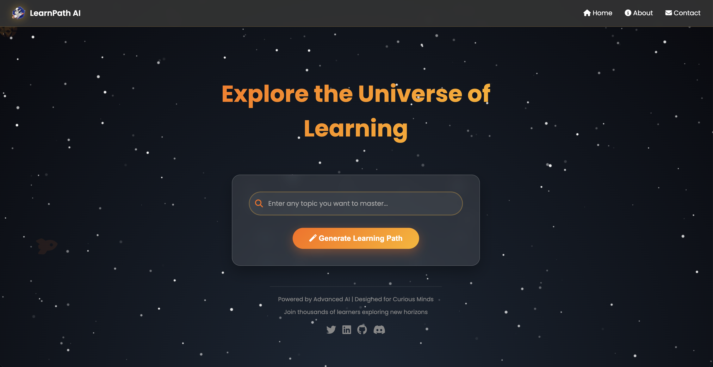
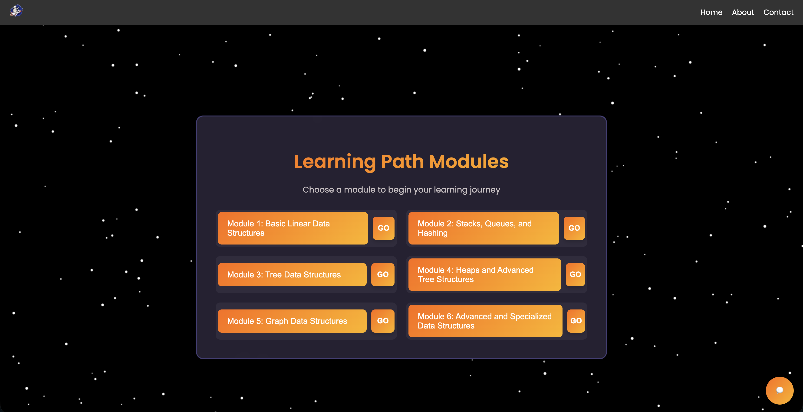
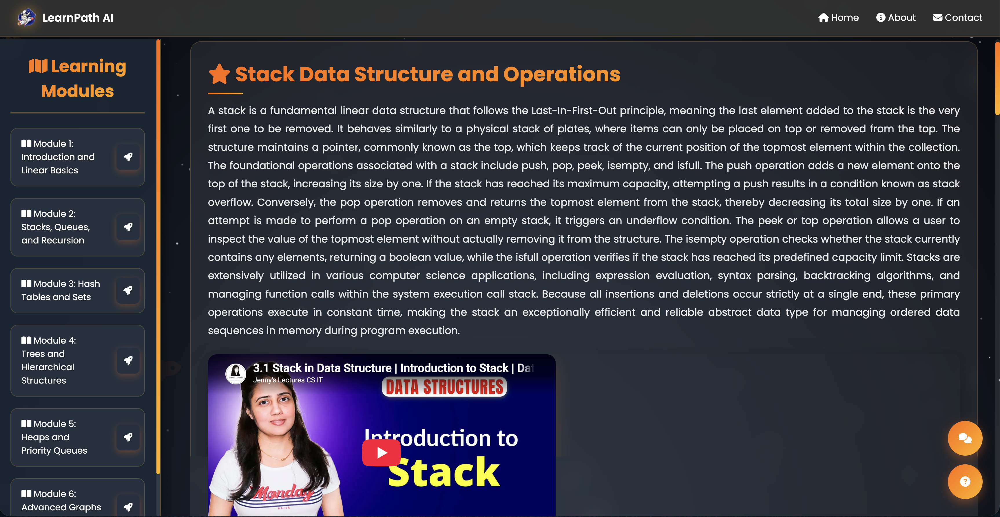
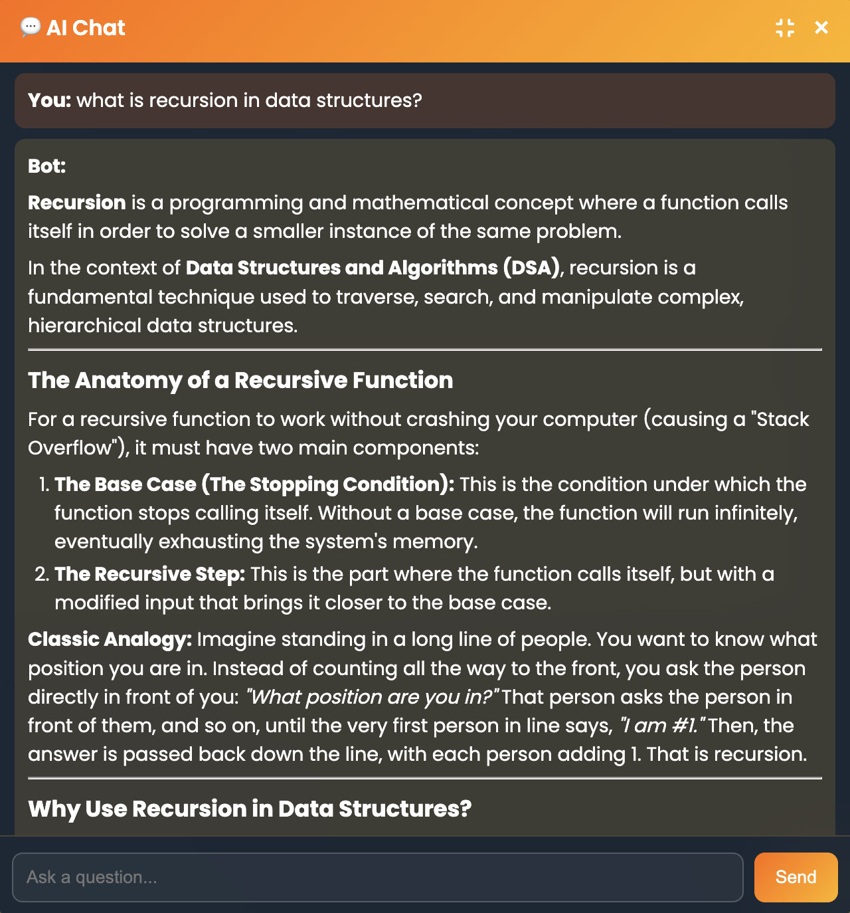

# 🎓 AI Chatbot for Personalised Student Assistance

A web-based learning assistant powered by Google's **Gemini AI**. Students can enter any
topic or question, and the app generates a **structured learning path**, **module content**,
**recommended YouTube tutorials**, and **auto-generated quizzes** — or simply chat with an AI tutor.

---

## ✨ Features

- **Smart input detection** – automatically figures out whether you typed a *topic* or a *question*.
- **Learning paths** – enter a topic (e.g. *"Data Structures"*) and get a 6-module curriculum,
  each with 5 subtopics, ordered from basics to advanced.
- **Module pages** – each module generates detailed explanations plus relevant YouTube video links.
- **Step-by-step answers** – ask a question and get a clear, tutor-style breakdown (restate →
  key concepts → approach → apply → summary).
- **Auto-generated quizzes** – 5-question multiple-choice quizzes per module with scoring.
- **AI chat** – a free-form chat page to ask the AI tutor anything.

---

## 📸 Screenshots

> _Screenshots coming soon — placeholders below. Replace them with your own images._

| Home page | Learning path |
|-----------|---------------|
|  |  |

| Module page | AI chat |
|-------------|---------|
|  |  |

**How to add your screenshots:**
1. Run the app and open each page in your browser.
2. Take a screenshot (Mac: `Cmd + Shift + 4`, then drag to select).
3. Create a `screenshots/` folder in the project and save the images there using the exact
   names above (`home.png`, `learning-path.png`, `module.png`, `chat.png`).
4. Commit and push them:
   ```bash
   git add screenshots/
   git commit -m "Add screenshots"
   git push
   ```
5. Refresh your GitHub page — the images will appear automatically.

---

## 🛠️ Tech Stack

- **Backend:** Python, [Flask](https://flask.palletsprojects.com/)
- **AI:** [Google Gemini API](https://ai.google.dev/) via the `google-genai` SDK
- **Frontend:** HTML + Jinja2 templates, CSS
- **Other:** `markdown`, `requests`, `beautifulsoup4`, `python-dotenv`

---

## 📁 Project Structure

```
Student_Chatbot/
├── app.py                # Main Flask application (routes + AI logic)
├── requirements.txt      # Python dependencies
├── .env.example          # Template for your API key (copy to .env)
├── .gitignore            # Keeps .env and .venv out of git
├── static/
│   ├── style.css
│   └── astronaut.png
└── templates/
    ├── index.html        # Home page (enter a topic/question)
    ├── result.html       # Learning-path results
    ├── response.html     # Step-by-step answer to a question
    ├── chat.html         # AI chat page
    ├── About.html
    ├── Contact.html
    └── modules/
        └── module1.html ... module6.html
```

---

## 🚀 Getting Started

### 1. Clone the repository
```bash
git clone https://github.com/<your-username>/<your-repo>.git
cd <your-repo>
```

### 2. Create a virtual environment and install dependencies
```bash
python3 -m venv .venv
source .venv/bin/activate          # On Windows: .venv\Scripts\activate
pip install -r requirements.txt
```

### 3. Add your Gemini API key
Get a free key from **[Google AI Studio](https://aistudio.google.com/app/apikey)**, then:
```bash
cp .env.example .env               # On Windows: copy .env.example .env
```
Open `.env` and paste your key:
```
GEMINI_API_KEY=your_key_here
```

### 4. Run the app
```bash
python app.py
```
Open your browser at **http://127.0.0.1:5001**

---

## 🗺️ Routes

| Route            | Description                                  |
|------------------|----------------------------------------------|
| `/`              | Home page – enter a topic or question        |
| `/generate`      | Processes input → learning path or answer    |
| `/1` … `/6`      | Module pages with content + video links      |
| `/q1` … `/q6`    | Quizzes for each module                      |
| `/c`             | AI chat page                                 |
| `/chat`          | Chat API endpoint (POST)                     |
| `/about`         | About page                                   |
| `/contact`       | Contact page                                 |

---

## ⚠️ Notes & Limitations

- **API key is required.** The app won't generate content without a valid `GEMINI_API_KEY`.
- **Free-tier quota.** Google's free tier limits how many requests you can make per day.
  Opening a full module page uses ~6 requests, so heavy use may hit the daily limit — it
  resets automatically at midnight Pacific Time.
- **Keep your key private.** Never commit your real `.env` file. It's already listed in
  `.gitignore`, so `git` will not upload it.

---

## 📌 Future Improvements

- Persist learning paths (currently stored in memory and reset when the server restarts).
- User accounts and progress tracking.
- Caching AI responses to reduce API usage.

---

*Built as a learning project. Contributions and suggestions welcome!*
